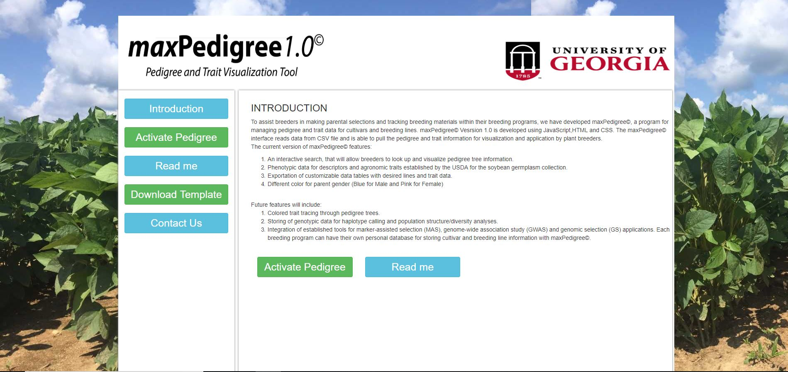
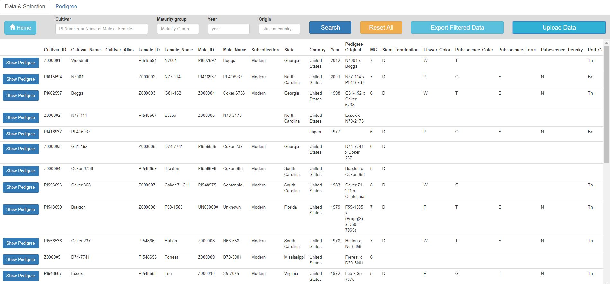
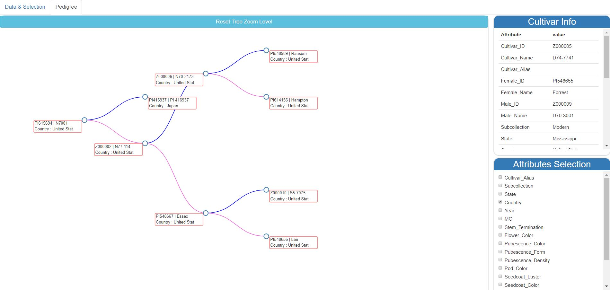

<h1 align="center">maxPedigree1.0</h1>

Abstract

To assist breeders in making parental selections and tracking breeding materials within their breeding programs, we have developed maxPedigree©, a program for managing pedigree and trait data for cultivars and breeding lines. maxPedigree©  Vesrsion 1.0 is developed using JavaScript,HTML and CSS. The maxPedigree© interface reads data from CSV file and is able to pull the pedigree and trait information for visualization and application by plant breeders.  Click here for Version 2.0 : 
<a href="https://github.com/ankitjoshi14/maxpedigree2.0"> MaxPedigree v2.0</a>

 The current version of maxPedigree©  features:
<ol>
  <li>An interactive search, that will allow breeders to look up and visualize pedigree tree information. </li>
  <li> Phenotypic data for descriptors and agronomic traits established by the USDA for the soybean germplasm collection</li>
  <li> Exportation of customizable data tables with desired lines and trait data.</li>
  <li> Different color for parent gender (Blue for Male and Pink for Female)</li>
</ol>

An interactive searchbar with data table, export and import feature

                  
                  
 Pedigree tree with different color for parent gender (Blue for MALE and Pink for FEMALE)

                  
               
 Future features will include:
 
               <ol>
                  <li> Colored trait tracing through pedigree trees.</li>
                  <li> Storing of genotypic data for haplotype calling and population structure/diversity analyses. </li>
                  <li> Integration of established tools for marker-assisted selection (MAS), genome-wide association study (GWAS) and genomic selection (GS) applications. Each breeding program can have their own personal database for storing cultivar and breeding line information with maxPedigree©.</li>
               </ol>
               
